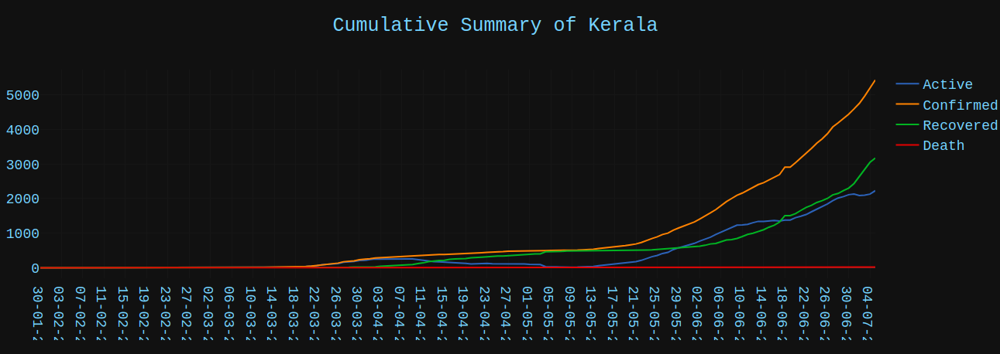
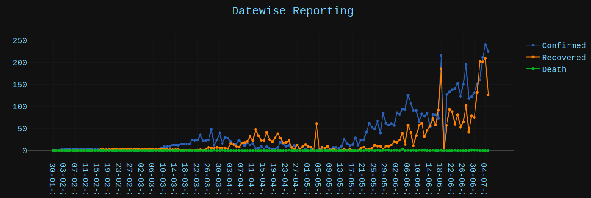
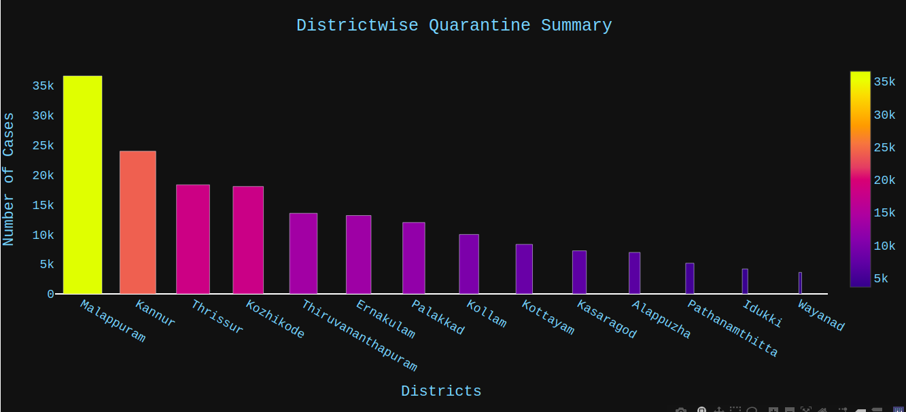
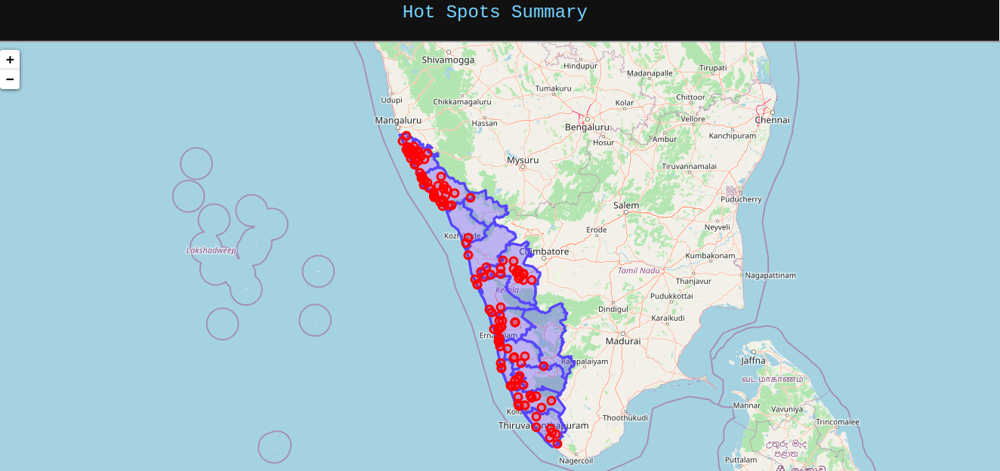

# C-Tracker Kerala
C-TRACKER KERALA is A web application  for tracking COVID-19 spread all over KeralaC-TRACKER KERALA: A web application  for tracking COVID-19 spread all over Kerala
# Datasets
| Data                                                  | URL                                                         |
| ----------------------------------------------------- | ----------------------------------------------------------- |
| Time-series District-wise Histories of COVID-19 stats | https://keralastats.coronasafe.live/histories.json          |
| Latest District-wise COVID-19 stats                   | https://keralastats.coronasafe.live/latest.json             |
| Latest Summary of COVID-19 stats                      | https://keralastats.coronasafe.live/summary.json            |
| Time-series Test Reports                              | https://keralastats.coronasafe.live/testreports.json        |
| Time-series Hotspots Histories                        | https://keralastats.coronasafe.live/hotspots_histories.json |
| Latest Hotspots                                       | https://keralastats.coronasafe.live/hotspots.json           |

# Packages
- plotly
- folium
- requests
- pandas
- Dash
# Install  packages with pip: 
pip install -r requirements.txt

## How to run this app

(The following instructions apply to Posix/bash. Windows users should check
[here](https://docs.python.org/3/library/venv.html).)

First, clone this repository and open a terminal inside the root folder.

Create and activate a new virtual environment (recommended) by running
the following:

```bash
python3 -m venv myvenv
source myvenv/bin/activate
```

Install the requirements:

```bash
pip install -r requirements.txt
```
Run the app:

```bash
python3 app.py
```
Open a browser at http://127.0.0.1:8050
# Screenshot





# Demo
Open a browser at https://ctrackerkerala.herokuapp.com/
